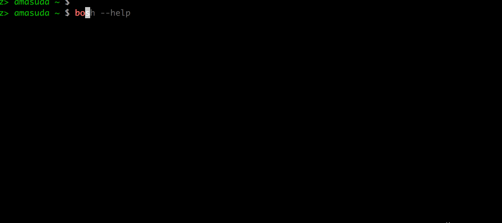

# Summary

Auto-completion for the BOSH CLI.



**Supports v2 and v3**

If you are installing [bash-completion](https://github.com/scop/bash-completion) and installed bosh-cli via homebrew then you have nothing to do because bosh-cli includes [jessevdk/go-flags](https://github.com/cloudfoundry/bosh-cli/tree/master/vendor/github.com/jessevdk/go-flags) which generates a completion file for bash completion.

## install

```
make
```
will locate completion file to /usr/local/etc/bosh.completion.bash

If you want to remove, then
```
make clean
```
will do.

## bash

If you are not using bash-completion then
```
if [[ -f /usr/local/etc/bosh.completion.bash ]]; then
    source /usr/local/etc/bosh.completion.bash
fi
```
Put above lines to .bashrc if needed.

## zsh
Use bashcompinit
```
autoload -U bashcompinit; bashcompinit
if [[ -f /usr/local/etc/bosh.completion.bash ]]; then
    source /usr/local/etc/bosh.completion.bash
fi
```
Put above lines to .zshrc if needed.
